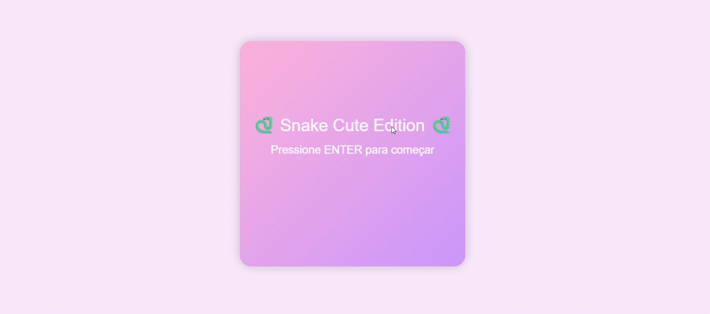
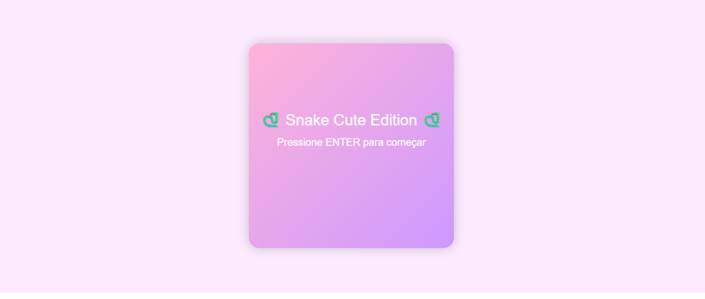
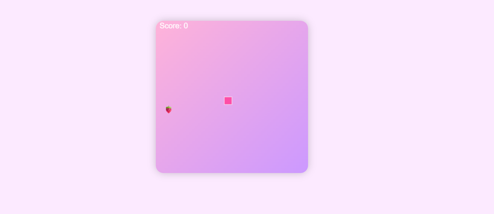

# 🎮 Snake Game 🐍

Um jogo clássico da cobrinha recriado com HTML, CSS e JavaScript, mas em uma versão fofa, colorida e moderna.
Possui tela inicial, placar, tela de game over e um visual estilizado com degradê.  

- Parte 7 do desafio **100 dias de código**.
  
--- 

## 📸 Preview



---

## 🚀 Funcionalidades

- Tela inicial personalizada
- Tela de Game Over com pontuação final
- Fundo com degradê 
- Comida da cobrinha representada por emoji
- Placar em tempo real

---

## 🎨 Design
- **Cores:**  Rosa, lilás e Branco ( degradê ).
- **Principais Fonte:**  Arial.
- **Estilo:** Cozy e moderno.



---

## 🛠️ Tecnologias utilizadas
- **HTML5**
- **CSS3** 
- **JavaScript** ES6
- **API Canvas**

---

## 🚀 Como usar
1. Clone este repositório:
   ```bash
   git clone https://github.com/IsabellyLeite/Snake-Game
2. Abra o arquivo index.html no navegador.
4. Na tela inicial, pressione ENTER para começar.
5. Use as setas do teclado para mover a cobrinha:
⬆️ Cima
⬇️ Baixo
⬅️ Esquerda
➡️ Direita
   ,ou se preferir ( W,A,S,D).
6. Coma as frutinhas 🍓 para aumentar sua pontuação.
7. O jogo acaba se você bater na parede ou no próprio corpo.
8. Após o Game Over, pressione ENTER para recomeçar.


---
Feito com carinho por Isa ❤️
